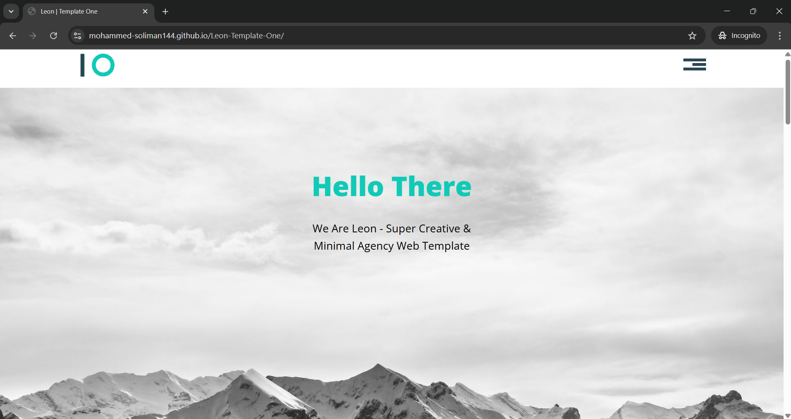

# Leon Template

Landing Page with navigation bar and reponsive design

## Live Demo

**[view live demo here](https://mohammed-soliman144.github.io/Leon-Template-One/)**

### Features

**1-responsive design:** works seamlessly on desktops, tablets and smart phones

**2-interactive UI:** built with HTML, CSS and modern JavaScript for achieve valuable user experience

**3-Smooth Scrolling:** scrolling to each section in smoothly way

## Technologies Used

HTML5

CSS3

JAVASCRIPT (ES6+)

## How To Run Locally or Download

**Clone the repo:** git clone https://github.com/mohammed-soliman144/Leon-Template-One.git

**Navigate To The Project directory:** cd Leon-Template-One

**Open index.html** in your web browser

## Author

**Mohammed Soliman**

**[Github Profile](https://github.com/mohammed-soliman144)**

**[Business Email](mohammed-soliman144@gmail.com)**

## License

This Project is licensed under the MIT License.

